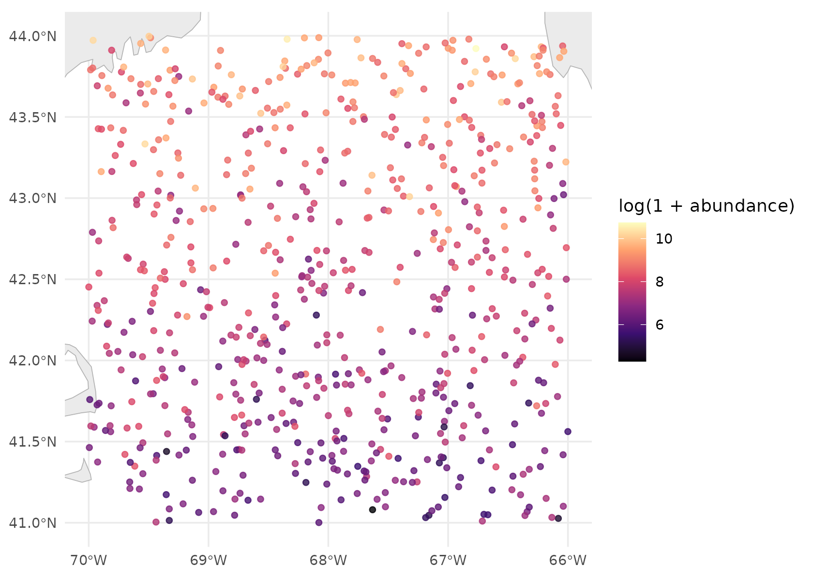
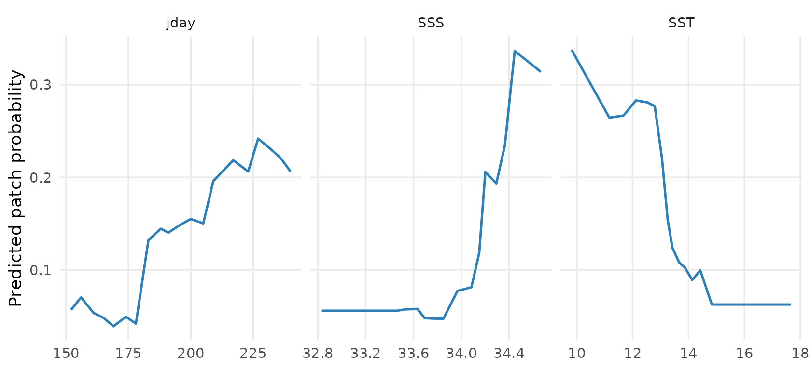
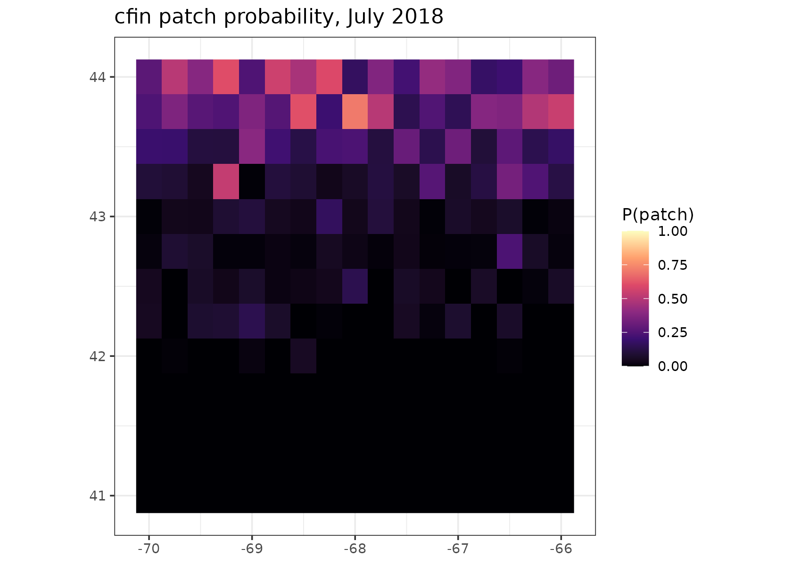

# Getting started with taupatch

``` r

library(taupatch)
```

## What a run does

taupatch answers one question, monthly, over an area: **where are the
patches?** A patch is a station whose abundance of some zooplankton
species exceeds a threshold — the top decile, say, or a stated number of
animals per square metre. Everything else is a non-patch.

That turns an abundance survey into a presence/absence problem, which a
classifier can be fitted to and a fitted classifier can be projected
onto a grid. Five stages, in order:

1.  **Load** the station data and label each station patch or non-patch.
2.  **Fetch** environmental covariates for the study area and match them
    to the stations.
3.  **Fit** a model of patch probability on those covariates.
4.  **Evaluate** it against held-out folds.
5.  **Project** it onto the covariate grid, one map per month.

One config file describes all five. Two runs differ by a file rather
than by edited code, which is the whole design.

## A run you can do right now

The package ships a synthetic dataset and a config that uses it, so the
pipeline can be exercised before you have Copernicus credentials or a
station database. The covariate source is `mock`: nothing is downloaded.

``` r

config <- load_config(system.file("configs/mock_test.yaml", package = "taupatch"))

# Write into the session's temp directory rather than the installed package.
config$paths$zoop_file <- file.path(tempdir(), "mock_stations.csv")
config$paths$output_dir <- file.path(tempdir(), "taupatch_vignette")

generate_mock_zoop_data(config)
```

[`load_config()`](https://camilleross.org/taupatch/reference/load_config.md)
has already done more than read the file. It applied the defaults,
resolved every relative path against the config’s own location, and
checked what is cheap to check: that the species resolves, the
thresholds are well formed, the covariate names exist, and the columns
it declares are actually in the CSV. A mistyped covariate is an error
here, at no cost, rather than five minutes into a Copernicus download.

Now run it.

``` r

result <- run_taupatch(config)
```

That is the whole pipeline. On real data the same call takes as long as
the downloads do; here it takes a couple of seconds.

## Look at the stations first

Before reading any model output, look at what it was fitted on. This is
the step that catches a study area drawn wider than the survey, or an
abundance field that is mostly zeros.

``` r

station_summary(result$data)
#>           quantity        value
#> 1         Stations          684
#> 2            Years 2018 to 2019
#> 3   Months sampled      6, 7, 8
#> 4        Longitude   -70 to -66
#> 5         Latitude     41 to 44
#> 6 Median abundance         2326
#> 7  90th percentile         9573
#> 8          Maximum        46160
#> 9   Zero or absent           0%
```

Median abundance and the 90th percentile are the two numbers to check
against each other. The config asks for a 90th-percentile threshold, so
that second number *is* the patch threshold, and roughly a tenth of
stations are patches by construction. Hold on to that — it decides how
the evaluation has to be read.

``` r

plot_station_map(result$data)
```



## What came back

[`run_taupatch()`](https://camilleross.org/taupatch/reference/run_taupatch.md)
returns the fitted model, the projections, and the data behind both.

``` r

names(result)
#> [1] "config"          "data"            "model"           "projections"    
#> [5] "covariate_means" "jackknife"       "covariates"
names(result$model)
#>  [1] "workflow"                          "metrics"                          
#>  [3] "evaluation"                        "predictions"                      
#>  [5] "classification_threshold"          "classification_threshold_interval"
#>  [7] "importance"                        "ensemble"                         
#>  [9] "type"                              "model_data"                       
#> [11] "predictors"                        "threshold"
```

### Which covariates mattered

``` r

result$model$importance
#> # A tibble: 3 × 2
#>   variable importance
#>   <chr>         <dbl>
#> 1 SST           0.130
#> 2 jday          0.126
#> 3 SSS           0.108
```

Importance here is the drop in ROC AUC when a predictor is shuffled,
averaged over several shuffles. It is computed the same way whichever
model type was fitted, which is what makes a random forest’s ranking
comparable with a GAM’s — engine-reported importances are not, since
ranger’s permutation drop and xgboost’s split gain are different
quantities on different scales.

It says a predictor matters. It does not say what it *does*.

### What each covariate does

``` r

effects <- partial_effects(result$model$workflow,
                           result$model$model_data,
                           result$model$predictors)
plot_partial_effects(effects)
```



Each panel sweeps one predictor across its range with the others held at
the values they actually take, and plots the mean predicted patch
probability. The mock data plants a latitudinal gradient and a seasonal
cycle into both abundance and the covariates, so these curves should
bend — a flat panel on real data means a predictor that is carrying
nothing.

## Reading the evaluation

This is the part worth slowing down for, because the obvious reading of
it is wrong.

``` r

result$model$evaluation[, c("metric", "threshold", "value", "std_err",
                            "lower", "upper")]
#>       metric  threshold     value     std_err      lower     upper
#> 1    roc_auc         NA 0.8608983 0.023894825 0.81036985 0.8987184
#> 2     pr_auc         NA 0.3689001          NA 0.27015366 0.4977992
#> 3       sens 0.50000000 0.2000000 0.023728947 0.10905594 0.3035908
#> 4       spec 0.50000000 0.9725363 0.009625328 0.95914866 0.9841270
#> 5        tss 0.50000000 0.1725363          NA 0.08051098 0.2775213
#> 6  precision 0.50000000 0.4333333          NA 0.25806452 0.6129653
#> 7       sens 0.04544048 0.8923077          NA 0.71013324 0.9558983
#> 8       spec 0.04544048 0.7205170          NA 0.69357106 0.8801394
#> 9        tss 0.04544048 0.6128247          NA 0.54127301 0.7141987
#> 10 precision 0.04544048 0.2510823          NA 0.20930233 0.4309096
```

Every threshold-dependent metric appears twice, at two cutoffs, and the
table says which is which. That is deliberate.

The two uncertainty columns answer different questions, which is why
blanks in one do not mean missing data. `std_err` is the spread across
cross-validation folds — only the metrics averaged per fold have one,
and `pr_auc`, `tss` and `precision` come from the pooled held-out
predictions instead. `lower` and `upper` bootstrap those pooled
predictions, so every row has an interval: one column asks how much the
number moves when the model is refitted, the other how much it moves if
the survey had sampled different stations.

``` r

result$model$classification_threshold
#> [1] 0.04544048
result$model$classification_threshold_interval
#>      lower      upper 
#> 0.04544048 0.20332937
```

That cutoff is estimated from the same held-out predictions it then
scores, so it moves too — the interval above is how far, and each
bootstrap resample re-derives its own rather than being handed this one.
A wide range there means a binarised map depends on which stations
happened to be sampled.

**At the default 0.5 cutoff the model looks much worse than it is.**
With only a tenth of stations patches, a classifier that is genuinely
good at ranking will still put almost every station below 0.5, so
sensitivity reads terribly. Compare the two `sens` rows above: the same
model, the same predictions, a different number. Use
`classification_threshold` when you binarise a projection — it is also
written to `threshold.yaml` next to the outputs.

**ROC AUC flatters an imbalanced problem.** Its false-positive rate has
the large non-patch class in the denominator, so it stays high while
precision does not. `pr_auc` is the honest companion, and the gap
between the two is the thing to watch (Saito & Rehmsmeier 2015; Sofaer
et al. 2019).

The abundance threshold itself — the number of animals a patch starts at
— is separate from the probability cutoff, and is recorded too:

``` r

result$model$threshold
#> [1] 10000
```

A percentile run can therefore be reproduced later as an absolute one.

## The maps

One projection per configured month and year, written as a GeoTIFF and a
PNG, and pooled into a single CSV carrying coordinates and dates.

``` r

result$projections[, c("year", "month", "n_cells", "n_grid", "resolution")]
#> # A tibble: 6 × 5
#>    year month n_cells n_grid resolution
#>   <int> <int>   <int>  <int>      <dbl>
#> 1  2018     6     221    221       0.25
#> 2  2018     7     221    221       0.25
#> 3  2018     8     221    221       0.25
#> 4  2019     6     221    221       0.25
#> 5  2019     7     221    221       0.25
#> 6  2019     8     221    221       0.25
```

`n_cells` against `n_grid` is the gap report: how many cells of the
covariate grid actually got a prediction. When they disagree, a
covariate was missing there — cloud in the satellite chlorophyll, or a
neighbourhood-derived covariate that is undefined on the border of the
study area. That is what explains a patchy map, and the run log names
the covariate responsible.

The projection is onto the covariate grid at its own resolution, not
back onto the station locations, so the map is a surface rather than a
scatter of points.

``` r

suitability <- readr::read_csv(
  file.path(config$paths$output_dir, "projections", "suitability.csv"),
  show_col_types = FALSE
)

library(ggplot2)
ggplot(subset(suitability, year == 2018 & month == 7),
       aes(lon, lat, fill = suitability)) +
  geom_raster() +
  scale_fill_viridis_c(option = "magma", limits = c(0, 1), name = "P(patch)") +
  coord_quickmap() +
  labs(title = "cfin patch probability, July 2018", x = NULL, y = NULL) +
  theme_bw()
```



## How far to trust the map

Everything above is a point estimate. `projection.uncertainty` adds two
layers that say where not to believe it — off by default, because on a
real grid the extra prediction passes cost real time.

``` r

config$projection$uncertainty <- TRUE
config$paths$output_dir <- file.path(tempdir(), "taupatch_vignette_unc")

result <- run_taupatch(config)

suitability <- readr::read_csv(
  file.path(config$paths$output_dir, "projections", "suitability.csv"),
  show_col_types = FALSE
)
names(suitability)
#>  [1] "species"           "year"              "month"            
#>  [4] "lon"               "lat"               "suitability"      
#>  [7] "suitability_sd"    "suitability_lower" "suitability_upper"
#> [10] "novelty"           "novel_variable"
```

The models behind the interval are the ones cross-validation already
fitted and would otherwise have thrown away, so the ensemble itself is
free.

``` r

length(result$model$ensemble)
#> [1] 5
```

Two layers, two different questions. `suitability_sd` and the interval
say how much the surface moves when the model is refitted on resampled
data. `novelty` says whether the cell is somewhere the model has ever
been:

``` r

summary(suitability$novelty)
#>    Min. 1st Qu.  Median    Mean 3rd Qu.    Max. 
#>  -4.951  11.477  30.848  28.266  32.749  96.199

# Which covariate puts a cell outside the training range, where one is.
table(suitability$novel_variable[suitability$novelty < 0])
#> 
#> SSS SST 
#>  11   2
```

Novelty runs to 100 at the median of the training data and **goes
negative outside its range** — those cells are extrapolation, and the
model has no evidence for what it claims there.

Read both, and do not treat a narrow interval as reassurance on its own.
Every ensemble member was trained on the same data, so they can walk off
the end of it together and agree the whole way. That combination —
confident and novel — is the one to look for:

``` r

extrapolated <- suitability$novelty < 0
data.frame(
  cells = c(sum(!extrapolated), sum(extrapolated)),
  median_sd = round(c(median(suitability$suitability_sd[!extrapolated]),
                      median(suitability$suitability_sd[extrapolated])), 4),
  row.names = c("inside training range", "outside training range")
)
#>                        cells median_sd
#> inside training range   1313    0.0073
#> outside training range    13    0.0589
```

Each month gets a two-panel figure in `plots/`, and the layers go into
the GeoTIFF beside the mean rather than into a second file:

``` r

names(terra::rast(result$projections$geotiff[1]))
#> [1] "suitability"       "suitability_sd"    "suitability_lower"
#> [4] "suitability_upper" "novelty"
```

## What is on disk

``` r

list.files(config$paths$output_dir, recursive = TRUE)[1:20]
#>  [1] "covariates/monthly_means.csv"         
#>  [2] "covariates/SSS_heatmap.png"           
#>  [3] "covariates/SST_heatmap.png"           
#>  [4] "cv_metrics.csv"                       
#>  [5] "diagnostics/calibration.png"          
#>  [6] "diagnostics/cv_predictions.csv"       
#>  [7] "diagnostics/partial_effects.csv"      
#>  [8] "diagnostics/partial_effects.png"      
#>  [9] "diagnostics/pr_curve.png"             
#> [10] "diagnostics/roc_curve.png"            
#> [11] "diagnostics/threshold_performance.png"
#> [12] "evals.csv"                            
#> [13] "model.rds"                            
#> [14] "plots/cfin_2018_06_uncertainty.png"   
#> [15] "plots/cfin_2018_06.png"               
#> [16] "plots/cfin_2018_07_uncertainty.png"   
#> [17] "plots/cfin_2018_07.png"               
#> [18] "plots/cfin_2018_08_uncertainty.png"   
#> [19] "plots/cfin_2018_08.png"               
#> [20] "plots/cfin_2019_06_uncertainty.png"
```

`model.rds` is the fitted workflow, so a projection can be redone
without refitting. `diagnostics/cv_predictions.csv` holds the held-out
predictions, so any metric not in `evals.csv` can be computed without
refitting either.

## Which covariates are earning their place

Importance ranks the covariates a model has. It cannot say whether a
covariate is carrying anything the others were not already carrying — a
predictor can rank third and be entirely redundant.
[`jackknife_covariates()`](https://camilleross.org/taupatch/reference/jackknife_covariates.md)
answers that by refitting without each one, over the same folds, and
seeing how much worse the model ranks stations.

It needs no config block; the defaults are used when there is none.

``` r

jk <- jackknife_covariates(result$data, config)

jk[, c("variable", "score_full", "score_without", "score_only", "contribution")]
#>   variable score_full score_without score_only contribution
#> 1      SSS  0.8667142     0.8581152  0.8139542  0.008598942
#> 2      SST  0.8667142     0.8589691  0.7116931  0.007745092
#> 3     jday  0.8667142     0.8601408  0.6331076  0.006573314
```

Two halves, two questions. **`score_without`** is low when the covariate
carries something no other covariate has — its *unique* contribution,
which is what `contribution` measures. **`score_only`** is the model on
that covariate alone, so it is high when the covariate carries a lot
whether or not anything else carries it too.

Read the two columns against each other and the mock run says something
the importance table above could not. `jday` scores well on its own —
the synthetic data has a real seasonal cycle in it — and contributes
nothing on top of the others, which have absorbed the same seasonality.
That is information which is real *and* duplicated, and it is a very
different situation from information that is not there. Ranking on
`contribution` alone would treat the two identically.

Some contributions come out negative. That means the model scored
*better* on average without the covariate, which on this many stations
is noise rather than a finding — and it is exactly the case the test
exists to keep you from over-reading.

``` r

jk[, c("variable", "contribution", "statistic", "p_value", "p_adjusted",
       "significant")]
#>   variable contribution statistic   p_value p_adjusted significant
#> 1      SSS  0.008598942 0.3020841 0.3888218          1       FALSE
#> 2      SST  0.007745092 0.4276782 0.3454523          1       FALSE
#> 3     jday  0.006573314 0.3926253 0.3573103          1       FALSE
```

Nothing here is significant, and that is the right answer rather than a
broken test. Three covariates over a few hundred synthetic stations,
scored on five folds, is not enough evidence to establish that any one
of them is load-bearing. A test that returned confident answers from
this much data would be the one to distrust.

`p_value` is one-sided on the per-fold differences, with the variance
inflated to account for the folds sharing most of their training rows.
At five folds that inflation is a factor of 1.5 on the standard error,
so every statistic here is two-thirds of what a naive paired *t*-test
would have reported. It makes no difference to the verdict on this run —
these differences are nowhere near the boundary either way — but it is
the difference between a real finding and a false one when a covariate
lands close to it, which on real data is where the interesting ones
land. `p_adjusted` then accounts for having asked once per covariate. A
GLM or a GAM would also fill in `parametric_p` with a likelihood ratio
test; a forest has no likelihood, so it is `NA` here.

**Nothing is dropped.** That is the default, and it is deliberate:

``` r

jackknife_settings(config)   # NULL: this config has no jackknife block
#> NULL

# What dropping *would* have removed, under the settings the test ran with.
jackknife_dropped(jk)
#> [1] "jday"
```

Only one name comes back even though all three failed, because
`min_predictors` floors the model at two covariates and the ones handed
back are the strongest of those that failed.

A covariate that fails this test is one the *others already account for
on these stations*, which is a statement about collinearity in this
sample at least as much as about ecology. Depth and surface temperature
carry much of the same information on a shelf, and the test will call
either one redundant depending on which the model reached for first.
Turning `covariates.jackknife.drop` on tells the pipeline to act on it
anyway, and `keep` protects a covariate that is in the model because the
study is about it:

``` r

config$covariates$jackknife <- list(drop = TRUE, keep = "jday", workers = 4)
result <- run_taupatch(config)

result$jackknife                      # the table, also written to the run
result$config$covariates$exclude      # what came out
```

## Fitting all the models at once

Rather than choosing an algorithm, fit several and combine them. Set
`model.type` to `ensemble` and the pipeline does the rest — everything
after the fit works the same, so nothing else in the config changes.

Four types are available; two are used here because `xgboost` and `mgcv`
are suggested rather than required.

``` r

config$model$ensemble <- list(types = c("rf", "glm"), rule = "weighted_mean")
config$paths$output_dir <- file.path(tempdir(), "taupatch_vignette_ens")

result <- run_taupatch(config)
result$model
#> <taupatch ensemble>
#>   rule:  weighted_mean
#>   members (2 of 2 qualifying):
#>  type     score metric qualifies    weight
#>   glm 0.6709830    tss      TRUE 0.5015792
#>    rf 0.6667578    tss      TRUE 0.4984208
#> 
#>   ensemble ROC AUC (out of fold): 0.8987
#>   classification threshold: 0.1701
```

Each member’s score, and the weight it earned, is the first thing to
read. A table showing one member near 1.0 and the rest near zero is a
single model with extra steps.

``` r

result$model$summary
#>   type               label     score metric     cutoff qualifies    weight
#> 1  glm Logistic regression 0.6709830    tss 0.09317055      TRUE 0.5015792
#> 2   rf       Random forest 0.6667578    tss 0.16452381      TRUE 0.4984208
```

The ensemble’s evaluation is **its own**, not the average of its
members’. Every member was fitted on the same folds from the same seed,
so their held-out predictions line up row for row, and the combined
out-of-fold predictions go through the same evaluation as a single
model’s:

``` r

result$model$evaluation[1:2, c("metric", "value", "lower", "upper")]
#>    metric     value     lower     upper
#> 1 roc_auc 0.8986645 0.8626058 0.9271202
#> 2  pr_auc 0.4203016 0.3175984 0.5472320

# Each member's own, for comparison.
vapply(result$model$members,
       function(m) m$evaluation$value[m$evaluation$metric == "roc_auc" &
                                        is.na(m$evaluation$threshold)],
       numeric(1))
#>        rf       glm 
#> 0.8849567 0.9011302
```

That distinction matters. Combining members that make *different*
mistakes beats all of them; combining members that make the same
mistakes does not, and only a cross-validated ensemble prediction can
tell those apart.

Importance is weighted across members, with each member’s own kept
beside it — a predictor the forest leans on and the GLM ignores is a
fact about the shape of the relationship, and the average is the one
number that hides it.

``` r

result$model$importance
#> # A tibble: 3 × 4
#>   variable importance    rf      glm
#>   <chr>         <dbl> <dbl>    <dbl>
#> 1 SSS          0.263  0.123 0.402   
#> 2 jday         0.0737 0.121 0.0264  
#> 3 SST          0.0554 0.110 0.000698
```

Every combination rule is computed and written, so a committee map can
be read off the same file without refitting. `rule` only picks which one
becomes the `suitability` layer:

``` r

names(terra::rast(result$projections$geotiff[1]))
#>  [1] "suitability"           "suitability_sd"        "suitability_lower"    
#>  [4] "suitability_upper"     "algorithm_sd"          "algorithm_range"      
#>  [7] "n_algorithms"          "suitability_mean"      "suitability_median"   
#> [10] "suitability_committee" "member_glm"            "member_rf"            
#> [13] "novelty"
```

`algorithm_sd` is the new one, and it is **not** the same as
`suitability_sd` from the section above. That one is a single algorithm
refitted on resampled stations; this one is different algorithms looking
at the same stations and disagreeing. Both can be on at once, and a cell
can be quiet on one and loud on the other:

``` r

ens <- readr::read_csv(
  file.path(config$paths$output_dir, "projections", "suitability.csv"),
  show_col_types = FALSE
)

summary(ens[, c("suitability", "algorithm_sd", "suitability_sd")])
#>   suitability         algorithm_sd       suitability_sd     
#>  Min.   :2.965e-05   Min.   :4.910e-06   Min.   :0.0001085  
#>  1st Qu.:1.692e-03   1st Qu.:1.790e-03   1st Qu.:0.0024286  
#>  Median :1.662e-02   Median :9.338e-03   Median :0.0121502  
#>  Mean   :9.957e-02   Mean   :2.994e-02   Mean   :0.0295782  
#>  3rd Qu.:1.194e-01   3rd Qu.:3.588e-02   3rd Qu.:0.0468390  
#>  Max.   :7.457e-01   Max.   :3.555e-01   Max.   :0.2347471
```

## Moving to real data

Three things change, and nothing else does.

**The station file.** Point `paths.zoop_file` at your own CSV. If you
have the raw NOAA EcoMon export rather than a formatted database,
reshape it first —
[`format_zoop_data()`](https://camilleross.org/taupatch/reference/format_zoop_data.md)
splits the date, renames the coordinate columns, strips the units off
each taxon column and divides the abundances accordingly, and carries
everything else through untouched.

``` r

format_zoop_data("raw_ecomon.csv", write_to = "data/zooplankton.csv")
zoop_taxa("raw_ecomon.csv")   # every taxon the file carries
```

**The covariate source.** `covariates.source: copernicus` instead of
`mock`, and the [Copernicus Marine
Toolbox](https://help.marine.copernicus.eu/en/collections/4060068-copernicus-marine-toolbox)
installed and logged in. The covariate names stay the same:

``` r

covariate_info()[1:8, c("name", "label", "units", "spatial")]
#>   name                      label     units        spatial
#> 1  SST    Sea surface temperature degrees C 0.083° (~9 km)
#> 2  SSS       Sea surface salinity       PSU 0.083° (~9 km)
#> 3 BOTT         Bottom temperature degrees C 0.083° (~9 km)
#> 4 BOTS            Bottom salinity       PSU 0.083° (~9 km)
#> 5   UO  Eastward current velocity       m/s 0.083° (~9 km)
#> 6   VO Northward current velocity       m/s 0.083° (~9 km)
#> 7  SSH         Sea surface height         m 0.083° (~9 km)
#> 8  MLD          Mixed layer depth         m 0.083° (~9 km)
```

**The window and the area.** `dates`, `projection`, and
`study_area.bbox`. Draw the bounding box wider than your stations if you
use gradients or fronts, which are undefined on the edge of the grid.

Write the new config rather than hand-editing YAML —
[`generate_config()`](https://camilleross.org/taupatch/reference/generate_config.md)
validates as it writes, so a mistyped covariate is an error at that
call:

``` r

generate_config("cfin_gom",
                zoop_file = "data/zooplankton.csv",
                selected = c("SST", "SSS", "CHL"),
                bathymetry = "DEPTH",
                transform = list(log1p = c("CHL", "DEPTH")))
```

## Doing it without writing code

The same pipeline is a GUI. Every config field is a control, the run
streams its progress, and **Download config** turns whatever you clicked
into a YAML file you can re-run or hand to someone else.

``` r

run_taupatch_app()
```

## Where to go next

The README covers each config block in depth — thresholds, derived
covariates, transformations, resampling before the join, the four model
types and the diagnostics each one contributes. In R:

- [`?load_config`](https://camilleross.org/taupatch/reference/load_config.md),
  [`?generate_config`](https://camilleross.org/taupatch/reference/generate_config.md)
  — the config
- [`?covariate_info`](https://camilleross.org/taupatch/reference/covariate_info.md),
  [`?derivoce_covariates`](https://camilleross.org/taupatch/reference/derivoce_covariates.md)
  — what can be a predictor
- [`?covariate_transforms`](https://camilleross.org/taupatch/reference/covariate_transforms.md)
  — and what can be done to one
- [`?model_types`](https://camilleross.org/taupatch/reference/model_types.md)
  — the four models, and what each is good for
- [`?partial_effects`](https://camilleross.org/taupatch/reference/partial_effects.md),
  [`?gam_smooth_terms`](https://camilleross.org/taupatch/reference/gam_smooth_terms.md)
  — reading a fitted model
- [`?jackknife_covariates`](https://camilleross.org/taupatch/reference/jackknife_covariates.md),
  [`?jackknife_settings`](https://camilleross.org/taupatch/reference/jackknife_settings.md)
  — testing which covariates earn their place
- [`?fit_patch_ensemble`](https://camilleross.org/taupatch/reference/fit_patch_ensemble.md),
  [`?ensemble_settings`](https://camilleross.org/taupatch/reference/ensemble_settings.md),
  [`?ensemble_rules`](https://camilleross.org/taupatch/reference/ensemble_rules.md)
  — combining several model types

## Citing a run

taupatch is mostly plumbing between other people’s data and other
people’s methods. A run reaches Copernicus Marine products, NOAA
terrain, and station data none of which belong to this package, and fits
models and metrics that are each somebody’s paper.
`citation("taupatch")` gives this package and the paper it implements;
the [References section of the
README](https://github.com/chross22/taupatch#references) groups
everything else so you can pick out the subset a particular run actually
used. Each function’s own help page carries the references relevant to
it.
